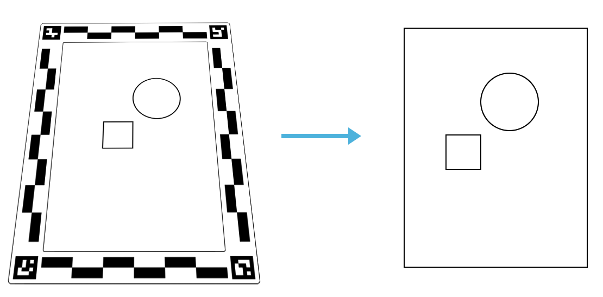

# Fork Preamble
This is a fork of the aruco-frame project by Quentin Bolsee at MIT CBA. The original repository is [here](https://gitlab.cba.mit.edu/quentinbolsee/aruco-frame).

The fork connects the homography calculation to [potrace](https://potrace.sourceforge.net/), in order to convert a hand-drawn image into a svg. 

To process the image, run `trace.sh <input_file> <output_file>`. Optionally, you can pass a `-k` flag to keep the intermediate files.

# Aruco Frame

 

This open source project lets you scan a drawing or image using an easy to build frame, and obtain a rectified image in real-life units. The frame exists in 3 different sizes, you can build your own by downloading the design files [here](./design).


## Installation

Steps:
- Clone or download this project, and place the folder somewhere
- Install python>3.8 ([link](https://www.python.org/downloads/))
- Add python to your system's path ([guide](https://realpython.com/add-python-to-path/))
- Open a terminal and navigate to the project's folder
- Install dependencies:

```
brew install imagemagick
brew install potrace
python -m pip install -r requirements.txt
```

- Test:

```
python aruco-frame.py -i example/raspi.jpg
```

## Usage

### Utilities
`magick` to convert png to bmp. `magick <input> <output>.bmp`
`potrace` to trace bmp to svg. `potrace <input>.bmp -o <output>.svg`

### Process an image:

```
python aruco-frame.py -i <FILENAME_IN>
```

If the output path is not specified with a `-o <FILENAME_OUT>` argument, the result is saved as `<FILENAME_IN>_<DPI>_DPI.png`.

## User manual

```
usage: aruco-frame.py [-h] [-i INPUT] [-o OUTPUT] [-d DPI] [-s] [-c CONFIG] [-v]

Extracts the image from an image containing an aruco frame

options:
  -h, --help            show this help message and exit
  -i INPUT, --input INPUT
                        Input filename.
  -o OUTPUT, --output OUTPUT
                        Output filename (default: <filename_in>_<DPI>_DPI.png).
  -d DPI, --dpi DPI     Manual output DPI (default: auto).
  -s, --show            Show debug image.
  -c CONFIG, --config CONFIG
                        Frame configuration file (default: ./config/config.json).
  -v, --verbose         Verbose mode (default: false).
```

## Authors and acknowledgment

Quentin Bolsee 2024

## License

This project is provided under the MIT License.
